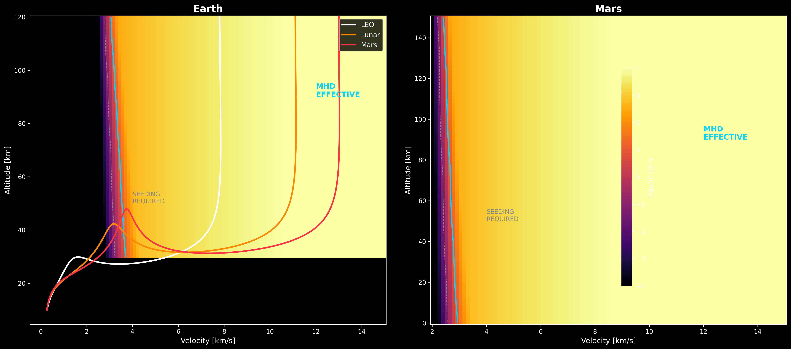

# AURORA-MHD Feasibility Study

**Can magnetohydrodynamic thermal protection be self-sustaining for Starship reentry? I built the models to find out.**



## Key Results

| Metric | v1 (uncoupled) | v11 (physics-corrected) |
|--------|----------------|------------------------|
| Magnet mass (2T, 20K) | 264 kg (infinite solenoid) | ~400–500 kg (finite, Fabry-corrected) |
| Flight system | 264 kg | ~600–800 kg (with 105 kg auxiliaries) |
| Energy closure | Self-sustaining at all B ≥ 0.5T | Positive at B ≥ 1.5T (ride-through) |
| Energy margin | 24× (ad-hoc 1000× loss) | ~4× (physics-based kinetic ceiling) |
| Kinetic ceiling | Not modeled | 456 kW (LEO, K=0.5) |
| MHD effective zone | σ > 10 S/m, v > 3 km/s | S > 10, 85 km → 40 km |
| Test suite | 58 tests | 88+ tests |

**The v11 model shows:** deflection is robust (S >> 1 everywhere), but self-sustaining extraction is feasible yet marginal. The v1→v11 progression demonstrates exactly which physics matter and by how much — see [RESULTS.md](RESULTS.md) for the full comparison.

## What This Is

A physics-based feasibility study for replacing Starship's ~18,000 ceramic heat shield tiles with superconducting magnets that deflect reentry plasma via magnetohydrodynamic (MHD) interaction. The study covers:

* **D1**: REBCO magnet mass-field trade space (Biot-Savart + SuperPower tape model)
* **D2**: Time-resolved energy balance — can MHD extraction power the system?
* **D3**: Operating envelope — where does MHD TPS work (Earth vs Mars)?

The repository implements two models side-by-side:
* **v1** — uncoupled Faraday extraction (naive, shows the physics coupling)
* **v11** — kinetic-ceiling-limited extraction (physically correct, shows the engineering margins)

## How to Run

```
git clone https://github.com/letsplay/aurora-mhd-feasibility.git
cd aurora-mhd-feasibility
pip install -r requirements.txt
pytest tests/ -v                    # 88+ tests (v1 regression + v11 physics)
jupyter notebook notebooks/         # open any notebook
```

## Repository Structure

```
src/
  geometry.py      — Blunt body mesh + Biot-Savart evaluation points
  magnets.py       — REBCO Ic(B,T) + CoilDesigner (v1 + v11 methods)
  atmosphere.py    — NRLMSISE-00 (Earth) + Mars exponential
  plasma.py        — Saha ionization + conductivity pipeline
  trajectory.py    — 3-DOF reentry with heat flux models
  mhd.py           — Faraday extraction + PowerDemand (v1 + v11)
  envelope.py      — Conductivity + Stuart number grids
  physics_v11.py   — All v11 corrections (Fabry, v_ps, Hall, ceiling)
tests/
  test_magnet.py   — 20 tests: geometry, Biot-Savart, REBCO, trade sweep
  test_energy.py   — 17 tests: atmosphere, trajectory, plasma, energy balance
  test_envelope.py — 8 tests: conductivity grids, zone classification
  test_v11.py      — 30+ tests: finite solenoid, kinetic ceiling, v11 pipeline
notebooks/
  01_magnet_trade.ipynb     — Parametric sweep + v11 trade table
  02_energy_closure.ipynb   — v1 vs v11 energy balance comparison
  03_operating_envelope.ipynb — σ + Stuart number maps with trajectories
```

## Author

Luc — PhD Applied Physics (CEA Saclay), 25+ years tech program management.
Exploring AI-accelerated MHD thermal protection for next-generation spacecraft.

## License

MIT
