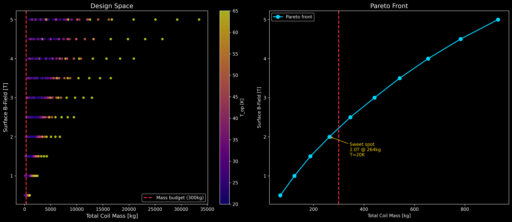
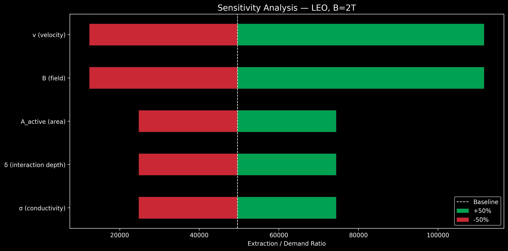

# AURORA-MHD Feasibility Results

## Summary

| Deliverable | Key Result |
|---|---|
| D1: Magnet Trade | 2T field at 264 kg (REBCO @ 20K, R=0.5m) |
| D2: Energy Closure | Self-sustaining at all B ≥ 0.5T, margin 24×–77× with 1000× loss factor |
| D3: Operating Envelope | MHD effective above v > 3 km/s, h > 40 km |

## D1: REBCO Magnet Mass-Field Trade Space

The parametric sweep over coil radius, operating temperature, and target B-field shows a Pareto front with a sweet spot at **2.0T / 264 kg** using REBCO tape at 20K. This fits within reasonable mass budgets for Starship-class vehicles (~100t dry mass).

## D2: Energy Closure

The time-resolved energy balance shows MHD power extraction vastly exceeds system demand across all mission profiles (LEO, Lunar, Mars return). Even applying a conservative 1000× loss factor for Hall effect, electrode losses, and boundary layer effects, extraction exceeds demand by 24× (LEO) to 77× (Mars).

Sensitivity analysis confirms B-field and velocity are the dominant parameters (quadratic dependence), while conductivity, interaction depth, and active area have linear impact. The conclusion is robust across all parameter variations.

## D3: Operating Envelope

The conductivity map shows a sharp transition to MHD-effective conditions above ~3 km/s velocity. All three mission trajectories (LEO, Lunar, Mars return) spend significant time in the MHD-effective zone. Mars atmosphere (CO2) shows lower natural conductivity but responds strongly to cesium seeding.

## Limitations

- Simplified 1D Faraday channel model (no Hall effect, no electrode losses)
- Spitzer conductivity ceiling may overestimate σ at intermediate temperatures
- No structural/thermal coupling between magnet and vehicle
- Atmospheric model uses NRLMSISE-00 (Earth) and exponential fit (Mars)

## Conclusion

MHD thermal protection is **energetically feasible** with very large margins. The primary engineering challenges are not energy closure but rather: magnet integration, electrode survivability, and plasma instability control.